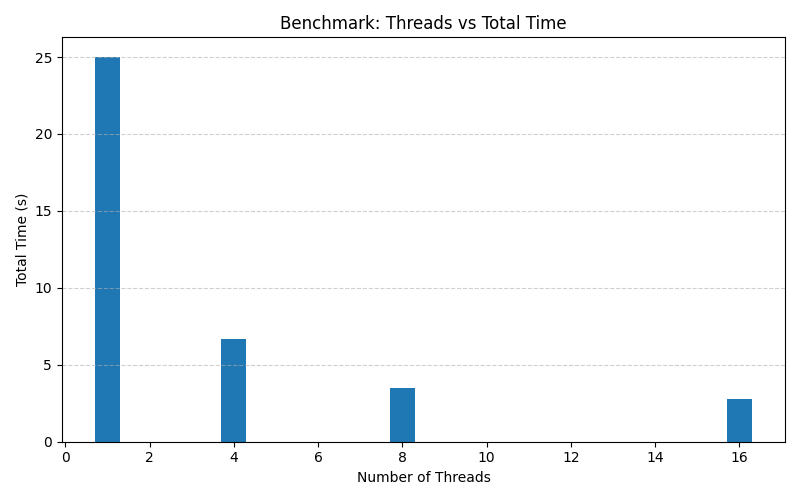

# 🧵 File Downloader Threads – Python Multithreading Simulator

[](https://www.python.org/downloads/release/python-3110/)
[](https://www.docker.com/)
[](./LICENSE)
[](#)

This project simulates concurrent file downloads using threads in Python, with controlled access to a shared file queue and performance metrics. The main goal is to demonstrate fundamental concepts such as concurrency, the GIL (Global Interpreter Lock), race conditions, and benchmarking with multiple threads.

---

## 🔧 Technologies used

- Python 3.11
- Docker + Docker Compose
- `threading.Thread` + `Lock`
- CLI with `argparse`
- Makefile to simplify execution

---

## 🧠 Explored concepts

### ✅ Concurrency with Threads

Download tasks are executed by multiple threads that share the same list of files. Each thread safely consumes one item at a time using a `Lock` to avoid race conditions.

### ❌ What is the GIL?

The GIL (*Global Interpreter Lock*) is an internal lock in CPython that **allows only one thread to execute Python bytecode at a time**, even on multicore systems.

**However**, in I/O-bound tasks (like the ones simulated here with `sleep()`), the GIL is temporarily released, allowing other threads to proceed. That’s why multithreading is still effective in scenarios such as:

- HTTP requests
- File access
- Waiting on databases

### 🔥 Multiprocessing

For **CPU-bound** tasks (e.g., heavy computation), the GIL becomes a bottleneck. In such cases, it's better to use `multiprocessing`, which creates **independent processes**, each with its own interpreter and GIL.

---

## 🚀 How to run the project

### 1. Clone the repository

```bash
git clone https://github.com/your-username/file-downloader-threads.git
cd file-downloader-threads
```

### 2. Container's build
```
docker compose build
```

### 3. Up container
```bash
docker compose up -d
```
### 4. Access container
```bash
docker exec -it threaded_downloader bash
```

## ✅ Commands available in the Makefile
Dentro do container, execute:
```
make run                 # Run with 4 threads (default)
make run-threads T=8     # Run with 8 threads
make benchmark           # Show total execution time with 4 threads
make benchmark-threads T=1  # Benchmark
```

## 🧪 Example benchmark output
```bash
Downloads started...
...
⏱ Benchmark: 4 thread(s) completed in 3.91 seconds.
```

## 📊 Benchmark Results


## 📂 Project structure
```bash
.
├── cli.py               # Comand line interface
├── main.py              # Entrypoint to control threads
├── downloader.py        # Concurrent consume logic
├── fake_server.py       # Download simulator
├── logger.py            # Global print locker
├── Makefile             # Execution automation
├── Dockerfile
├── docker-compose.yml
└── README.md

```
## 🧩 Possible future improvements
- Add multiprocessing version for benchmark comparison
- Export results to CSV
- Simulate errors and implement retry logic
- Web interface or dashboard for real-time visualization